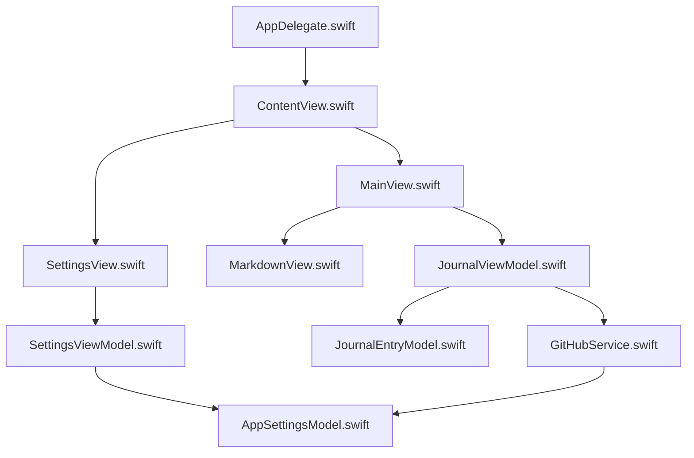

# My Own Journal アプリケーションアーキテクチャ

## 概要

My Own Journal は、GitHub リポジトリを使用してジャーナルを管理するための iOS アプリケーションです。このアプリケーションは SwiftUI を使用して構築されており、MVVM（Model-View-ViewModel）アーキテクチャパターンを採用しています。

## アーキテクチャ

アプリケーションは以下のコンポーネントで構成されています：

### MVVM アーキテクチャ

MVVM（Model-View-ViewModel）は、ユーザーインターフェイス（View）とビジネスロジック（Model）を分離するためのアーキテクチャパターンです。ViewModel は View と Model の間の仲介役として機能し、View からのユーザー操作を処理し、Model からのデータを View に提供します。

#### メリット

- **関心の分離**: UI、ビジネスロジック、データモデルが明確に分離されています。
- **テスト容易性**: ViewModel はビューから独立しているため、単体テストが容易です。
- **コード再利用**: 同じ ViewModel を異なる View で再利用できます。
- **メンテナンス性**: コードが整理されているため、メンテナンスが容易です。

## ファイル構成

### モデル（Model）

- **JournalEntryModel.swift**: ジャーナルデータモデルを定義します。
- **AppSettingsModel.swift**: アプリケーション設定データモデルを定義します。

### ビュー（View）

- **ContentView.swift**: メインのコンテナビューで、ナビゲーション制御を担当します。
- **MainView.swift**: ジャーナル表示・編集ビューを提供します。
- **SettingsView.swift**: 設定画面ビューを提供します。
- **MarkdownView.swift**: Markdown をレンダリングするためのビューを提供します。

### ビューモデル（ViewModel）

- **JournalViewModel.swift**: ジャーナル関連のビジネスロジックを担当します。
- **SettingsViewModel.swift**: 設定関連のビジネスロジックを担当します。

### サービス（Service）

- **GitHubService.swift**: GitHub API との通信を担当します。

### エントリーポイント

- **AppDelegate.swift**: アプリケーションのエントリーポイントです。

## データフロー

1. **設定の管理**:
   - ユーザーが SettingsView で設定を入力
   - SettingsViewModel が設定を検証し、AppSettingsModel に保存
   - AppSettingsModel が UserDefaults に設定を保存

2. **ジャーナルの読み込み**:
   - MainView が表示されると、JournalViewModel が loadJournal() を呼び出す
   - JournalViewModel が GitHubService を使用してジャーナルを取得
   - 取得したデータが JournalEntry モデルに格納され、MainView に表示

3. **ジャーナルの更新**:
   - ユーザーが MainView でテキストを入力し、送信ボタンをクリック
   - JournalViewModel が submitJournal() を呼び出す
   - JournalViewModel が GitHubService を使用してジャーナルを更新
   - 更新が成功すると、JournalViewModel が再度ジャーナルを読み込む

## コンポーネント間の依存関係

- **View → ViewModel**: View は ViewModel に依存し、ユーザー操作を ViewModel に委譲します。
- **ViewModel → Model**: ViewModel は Model に依存し、データの取得・更新を行います。
- **ViewModel → Service**: ViewModel は Service に依存し、外部 API との通信を行います。
- **Service → Model**: Service は Model に依存し、API レスポンスをモデルに変換します。

## 将来の拡張性

このアーキテクチャは、将来の機能追加や変更に対応できるように設計されています。例えば：

- 新しいデータソースの追加: GitHubService と同様のインターフェースを持つ新しいサービスを追加することで、異なるデータソースをサポートできます。
- UI の変更: ViewModel はビューから独立しているため、UI を変更しても、ビジネスロジックに影響を与えません。
- 新機能の追加: 新しい機能を追加する場合、既存のコンポーネントに影響を与えることなく、新しいモデル、ビュー、ビューモデルを追加できます。

## まとめ

My Own Journal アプリケーションは、MVVM アーキテクチャを採用することで、コードの可読性、メンテナンス性、テスト容易性を向上させています。各コンポーネントは明確な責任を持ち、適切に分離されているため、将来の拡張や変更に対応しやすい構造となっています。